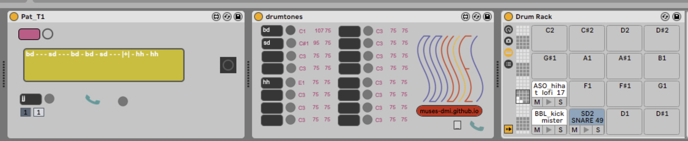

# Notions of Time

Music provides a means to explore time by sequencing musical events in a seemingly endless and expressive way. This potential often far exceeds the ability of digital systems to enable composers and performers to explore musical time, perhaps due to the influence of Western music on implementation or maybe due to the challenges involved in the notation of music itself. In this paper we look at ways to explore time within a musical context, looking to create tangible examples and methods for exploring complex rhythmic relationships using digital systems. We draw on the approach for describing sequences in terms of cycles, inspired by the live coding language Tidal Cycles.

A simple Domain Specific Language (DSL) is described, in order to realize a Digital Musical Instrument (DMI) that facilitates performing with polyrhythm in a intuitive and tactile way. This highlights the use of DSLs for the design of DMIs. Further, an abstraction for representing sequences of musical events on a digital system is provided, which facilitates complex rhythmic relationships (namely, polyrhythm and polymeter) and extends to handle modulation of time itself. The formal details of Pat can be found in the paper:

```
Nathan Renney and Benedict R. Gaster. (2019) Digital Expression and
Representation of Rhythm. AM'19: Proceedings of the 14th International
Audio Mostly Conference on Augmented and Participatory Sound and Music
Experiences.
```

This repo contains two implementations of Pat, the base one, which was originally 
developed in Haskell in conjunction with writing the paper. The second implementation
is in C++, developed so to support the development of max4live Muses Pat plugin, which
is compatible with [jr's](https://twitter.com/rjonline00) 
[smartphones](http://roomsonline.net/smartphones).  

Here's a snap shot of the Muses max4live plugin:



## Haskell version

As long an up-to-date version of Haskell's stack is installed do:

```
stack ghci
```

then at run something like:

```haskell
*Main Lib> parseString "bd sd bd [sd sd]"
```

which will output:

```haskell
PSeq [PT (TStr "bd"),PT (TStr "sd"),PT (TStr "bd"),PSeq [PT (TStr "sd"),PT (TStr "sd")]]
```

We can "compile" this with the command:

```haskell
*Main Lib> subdiv $ parseString "bd sd bd [sd sd]"
```

which will output:

```haskell
[PPLit "bd",PPLit "-",PPLit "sd",PPLit "-",PPLit "bd",PPLit "-",PPLit "sd",PPLit "sd"]
```

We can create a flatten output with:

```haskell
flatten' $ subdiv $ parseString "bd sd bd [sd sd]"
```

which will output:

```haskell
"bd - sd - bd - sd sd"
```

All this is combined in to a single function:

```haskell
*Main Lib Paths_pat> flatten "bd - bd - |:| hh - sn"
``` 

Here using a polyrhythmic (```|:|```) merge and will output:

```haskell
"[bd hh]  [- -]  [- -]  [- -]  [- -]  [- -]  [bd -]  [- -]  [- sn]  [- -]  [- -]  [- -] "
```

> note that this is a fully expanded sequence and "notes" within [] represents notes 
> that are played concurrently with on another.

We can do polymetric (```|+|```) merge too:

```haskell
*Main Lib Paths_pat> flatten "bd - bd - |+| hh - sd"
```

which outputs:

```haskell
"[bd hh]  [- -]  [bd sd]  [- hh]  [bd -]  [- sd]  [bd hh]  [- -]  [bd sd]  [- hh]  [bd -]  [- sd] "
```
# C++ Version

In the directory ```cplusplus```. This is a single header file **pat.hpp**. The basic API is 
complete, it supports parsing, flattening, and a simple printing.

It is used in the MAX MSP external that is utilized Muses Pat max4live plugin, 
providing an example of using Pat within a DAW context, in this case Ableton.

To use you simply need a C++ compiler capable of supporting C++17 or above.

## LICENSE

Licensed under any of

    Apache License, Version 2.0 (LICENSE-APACHE or http://www.apache.org/licenses/LICENSE-2.0)
    MIT license (LICENSE-MIT or http://opensource.org/licenses/MIT)
    Mozilla Public License 2.0